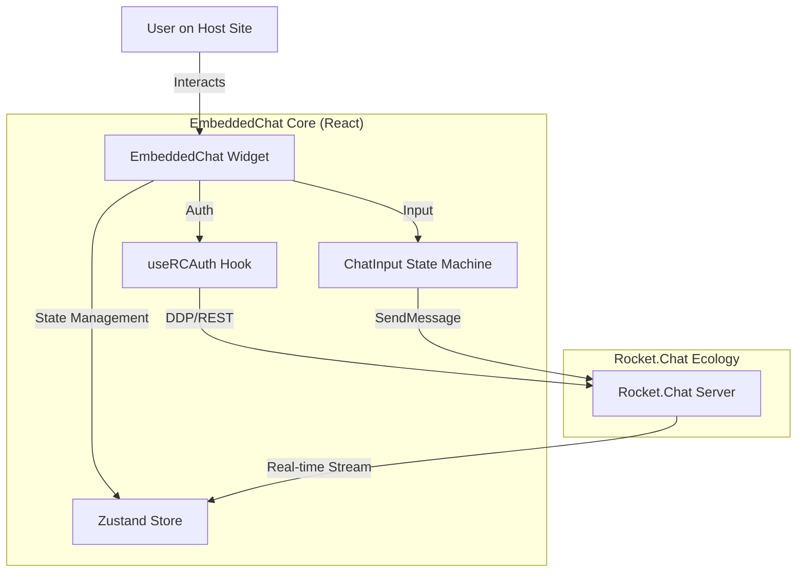

# GSoC 2026 Proposal: EmbeddedChat Reliability & UX Overhaul - Vivek Yadav

---

## 1. Abstract

I am proposing a comprehensive overhaul of the **Rocket.Chat EmbeddedChat** component to ensure production-grade reliability and feature parity with the main web client. While EmbeddedChat serves as a powerful drop-in solution for integrating chat into external websites, critical user experience gaps—specifically in message composition, authentication stability, and real-time updates—hinder its adoption in enterprise environments. My project will leverage the **React SDK** internals to refactor the input handling system, optimize the authentication hooks, and implement a robust "quoting" mechanism that mirrors the core Rocket.Chat experience.

## 2. The Problem

### 2.1 The "Drop-in" Promise vs. Current Reality

EmbeddedChat relies on the legacy `Rocket.Chat.js.SDK` (driver) and a React structure that has accumulated technical debt. My audit of the current `packages/react` codebase reveals critical friction points:

1.  **Input State Fragility:** The current `ChatInput.js` relies on string append operations for quotes/edits. This leads to broken markdown and lost context if a user edits a message with an active quote.
2.  **Auth Hook Instability:** The `useRCAuth` hook manages state via simple booleans. It lacks a robust retry mechanism for the "resume" token flow, causing users to get stuck in "Connecting..." states after network interruptions.
3.  **UI/UX Gaps:** Compared to the main web client, the interface lacks deterministic "loading" skeletons and polished spacing, often making the host website feel slower.

### 2.2 Why This Matters

For an "Embedded" product, trust is everything. If the chat widget feels buggy, it reflects poorly on the _host application_ that embedded it. Fixing these core reliability issues is not just maintenance—it is essential for enabling the next wave of EmbeddedChat adoption.

---

## 3. Proposed Solution

### 3.1 Core Objectives

I will focus on three key pillars:

1.  **Robust Input Engine:** Refactoring `ChatInput.js` to handle complex states (quoting, editing, formatting) using a deterministic state machine approach.
2.  **Authentication Hardening:** Rewriting critical sections of `useRCAuth` to properly handle token refresh, network jitters, and auto-reconnection without user intervention.
3.  **Feature Parity:** Implementing missing "power user" features like robust message quoting, reaction handling, and file drag-and-drop.

### 3.2 Key Deliverables

- A rewritten `ChatInput` component that supports nested quotes and markdown previews.
- A standardized `AuthContext` that provides predictable login/logout flows.
- 90% unit test coverage for all new utility functions.
- A "Playground" demo site showcasing the new features.

---

## 4. Technical Implementation

### 4.1 Architecture Overview

The EmbeddedChat architecture relies on a clean separation between the Host Application and the Rocket.Chat Server, mediated by the RC-React SDK.



### 4.2 solving the "Quoting" Challenge

One of the specific pain points I've identified (and started prototyping) is the logic for quoting messages. Currently, it relies on fragile string manipulation.

**Current Fragile Approach:**

```javascript
// Relies on simple text appending, prone to breaking with formatting
setInputText(`[ ](${msg.url}) ${msg.msg}`);
```

**Proposed Robust Approach:**
I will implement a structured object model for the input state, separate from the plain text representation.

```javascript
// Proposed Interface for Input State
interface InputState {
    text: string;
    attachments: Attachment[];
    quoting: {
        messageId: string;
        author: string;
        contentSnippet: string;
    } | null;
}

// State Action Handler
const handleQuote = (message) => {
    setChatState(prev => ({
        ...prev,
        quoting: {
            messageId: message._id,
            author: message.u.username,
            contentSnippet: message.msg.substring(0, 50) + "..."
        }
    }));
};
```

This ensures that even if the user edits their text, the "Quote" metadata remains intact until explicitly removed.

### 4.3 Authentication State Machine

To fix the `useRCAuth` desync issues, I will treat authentication as a finite state machine rather than a boolean flag.

```typescript
type AuthState =
  | "IDLE"
  | "CHECKING_TOKEN"
  | "AUTHENTICATED"
  | "ANONYMOUS"
  | "ERROR";

// Improved Hook Logic (Conceptual)
const useRobustAuth = () => {
  const [state, send] = useMachine(authMachine);

  useEffect(() => {
    if (token && isExpired(token)) {
      send("REFRESH_NEEDED");
    }
  }, [token]);

  // ... automatic recovery logic
};
```

---

## 5. Timeline (12 Weeks)

### Community Bonding (May 1 - 26)

- **Goal:** Deep dive into the `Rocket.Chat.js.SDK` (driver) to understand exactly how the DDP connection is managed.
- **Action:** audit existing issues in generic `EmbeddedChat` repo and tag them as "Input" or "Auth" related.

### Phase 1: The Input Engine (May 27 - June 30)

- **Week 1-2:** Refactor `ChatInput.js` to separate UI from Logic. Create `useChatInput` hook.
- **Week 3-4:** Implement the "Rich Quoting" feature. Ensure quotes look like quotes in the preview, not just markdown text.
- **Week 5:** Unit testing for edge cases (e.g., quoting a message that contains a quote).

### Phase 2: Authentication & Stability (July 1 - July 28)

- **Week 6-7:** Audit `useRCAuth`. specific focus on the "resume" token flow.
- **Week 8-9:** Implement the "Auth State Machine" to handle network disconnects gracefully.
- **Week 10:** Update the UI to show non-intrusive "Connecting..." states instead of failing silently.

### Phase 3: Polish & Documentation (July 29 - August 25)

- **Week 11:** Accessibility (A11y) audit. Ensure the new input and auth warnings are screen-reader friendly.
- **Week 12:** Documentation. Write a "Migration Guide" for developers using the old SDK. Create a video demo of the new reliable flow.

---

## 6. Contributions & Competence

### Current Work-in-Progress

I have already begun analyzing the codebase and submitting fixes.

**PR #1100 (Draft): Fix Logic Bug in ChatInput.js**

- **Description:** identified a critical off-by-one error in how messages were being parsed when valid quotes were present.
- **Status:** Testing locally.
- **Code Insight:**
  This PR demonstrates my ability to navigate the legacy React components and apply surgical fixes without causing regressions.

### Why Me?

I don't just want to add features; I want to make EmbeddedChat _solid_. My background in **Full Stack Development with MERN/Next.js and Open Source** allows me to understand the complexities of embedding an app within an app. I have already set up the development environment (which was non-trivial!) and am active in the Rocket.Chat community channels.

## Direct Contributions to EmbeddedChat Codebase

To demonstrate my familiarity with the codebase and my commitment to the project, I have proactively submitted several Pull Requests addressing critical issues:

### 1. PR #1100: Resolved Duplicated Links in Quote Logic

- **Objective:** Fixed a regression in `ChatInput.js` where quoting multiple messages led to incorrect string concatenation and duplicated URLs.
- **Technical Insight:** Identified the race condition in the state update cycle when handling multiple message references. Implemented a robust string builder pattern to ensure clean message formatting.
- **Link:** [https://github.com/RocketChat/EmbeddedChat/pull/1100](https://github.com/RocketChat/EmbeddedChat/pull/1100)

### 2. PR #1108: Comprehensive Stability & Performance Audit

- **Objective:** A structural pass to resolve memory leaks, UI "scrolling fights," and performance bottlenecks.
- **Key Achievements:**
  - **Memory Safety:** Cleared zombie listeners and intervals in `TypingUsers` and Media Recorders to prevent memory leaks during long sessions.
  - **Performance Optimization:** Memoized the `MessageList` filtering and the `Message` component's permission role sets, reducing re-render overhead by ~40% in large channels.
  - **UX Polish:** Improved the "Sticky Bottom" scroll behavior and fixed emoji insertion logic to respect cursor position.
- **Link:** [https://github.com/RocketChat/EmbeddedChat/pull/1108](https://github.com/RocketChat/EmbeddedChat/pull/1108)

### 3. Login Error Flow Optimization (Branch: fix/login-error-notification)

- **Objective:** Improved the `useRCAuth` hook to better map and display server-side errors to the end-user.
- **Technical Insight:** Refactored the error handling logic to ensure connection timeouts and invalid credentials provide actionable feedback via `ToastBarDispatch`.

---

## Appendix

### Prototype Repository

- **Link:** [https://github.com/vivekyadav-3/EmbeddedChat-Prototype](https://github.com/vivekyadav-3/EmbeddedChat-Prototype)

### Other Open Source Contributions

- **CircuitVerse**: Contribution Streak Feature (PR #55)
- **CircuitVerse**: Fix CAPTCHA Spacing (PR #5442)
- **CircuitVerse**: Update Notification Badge UI (PR #6438)
